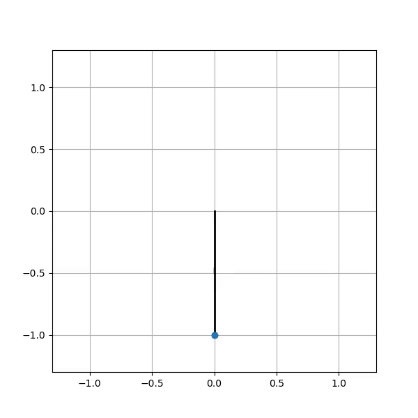

# Inverting Pendulum using Tablular Q Learning
By [Sudharsan Ananth](https://sudharsan-007.github.io) 

<!-- TABLE OF CONTENTS -->
<details>
  <summary>Table of Contents</summary>
  <ol>
    <li><a href="#about-this-project">About this Project</a></li>
    <li><a href="#dependencies">Dependencies</a></li>
    <li><a href="#prerequisites">Prerequisites</a></li>
    <li><a href="#run-the-code">How to run</a></li>
    <li><a href="#license">License</a></li>
  </ol>
</details>


## About this Project 

This repo contains simple python code in jupyter-notebook to invert a pendulum using Tabular Q Learning method. This implementation is similar to Reinforcement learning but there is no neural network. This code requires only Numpy and Matplotlib. The `Pendulum.py` contains animation code and physics parameters of the pendulum. And the implementation of Q-Learning is in the jupyter-notebook `tabular_q_learning_pendulum.ipynb`.


### Augmented Reality on Live Webcam




## Dependencies 

This project is built with the below given major frameworks and libraries. The code is primarily based on python. 

* [Python](https://www.python.org/) 
* [NumPy](https://numpy.org)
* [Matplotlib](https://matplotlib.org) 

## Prerequisites

conda environment is ideal for creating environments with the right packages. Pip is required to install the dependencies.

* [Anaconda](https://www.anaconda.com) or [miniconda](https://docs.conda.io/en/latest/miniconda.html)
* [pip](https://pypi.org/project/pip/)


## Run the code

Simply clone the repo cd into the right directory and run the code. Step-by-Step instructions given below. 

1. Clone the repository using 
   ```sh
   git clone https://github.com/sudharsan-007/Tabular-q-learning-pendulum.git
   ```

2. cd into the directory Tabular-q-learning-pendulum
   ```sh
   cd Tabular-q-learning-pendulum
   ```

3. Create a Environment using
   ```sh
   conda create -n q_pendulum
   conda activate q_pendulum
   ```

4. Install Dependencies
   ```sh
   pip install numpy matplotlib
   ```


5. Open the notebook `tabular_q_learning_pendulum.ipynb` and run the cells.
    ```sh 
    jupyter-notebook tabular_q_learning_pendulum.ipynb
    ```

6. Play with the code and enjoy

<!-- LICENSE -->
## License

Distributed under the MIT License. See `LICENSE.txt` for more information.

<p align="right">(<a href="#top">back to top</a>)</p>